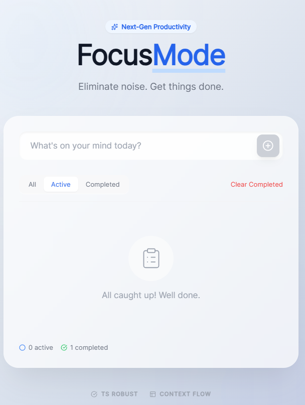

# 📝 TodoWebApp (React + Tailwind CSS)

AI 에이전트와 협업하여 구축한 사용자 친화적인 할 일 관리 웹 애플리케이션입니다. React 18과 Tailwind CSS를 활용하여 빠르고 세련된 UI를 제공하며, 효율적인 상태 관리를 지향합니다.

## 🚀 기술 스택 (Tech Stack)

* **Frontend**: React 18 (Functional Components, Hooks)
* **Styling**: Tailwind CSS (Utility-first CSS)
* **Build Tool**: Vite (Next Generation Frontend Tooling)
* **State Management**: React Context API
* **Language**: JavaScript / TypeScript (선택에 따라 수정 가능)

## ✨ 핵심 기능 (Key Features)

* **할 일 추가/삭제**: 실시간으로 할 일을 관리하는 CRUD 기능
* **반응형 디자인**: 모바일 및 데스크톱 환경 모두에 최적화된 레이아웃
* **클린 코드**: 유지보수가 용이한 컴포넌트 기반 아키텍처
* **다크 모드 지원**: (추가 예정인 경우 포함)

## 🛠️ 설치 및 실행 방법 (Installation & Usage)

프로젝트를 로컬 환경에서 실행하려면 다음 단계를 따르세요.

### 1. 저장소 클론 (Clone the Repository)
```bash
git clone https://github.com/swkim777/TodoWebApp.git
cd TodoWebApp
```

### 2. 의존성 설치 (Install Dependencies)
```bash
npm install
```

### 3. 개발 서버 실행 (Run Development Server)
```bash
npm run dev
```
브라우저에서 `http://localhost:5173` 접속 시 앱을 확인할 수 있습니다.

## 📂 프로젝트 구조 (Project Structure)

```text
TodoWebApp/
├── public/              # 정적 자산 (favicon 등)
├── src/
│   ├── api/            # 외부 API 연동 로직
│   ├── components/     # 재사용 가능한 UI 컴포넌트
│   ├── hooks/          # 커스텀 React Hooks
│   ├── store/          # Context API 상태 관리
│   ├── App.js          # 메인 애플리케이션 컴포넌트
│   └── main.js         # 엔트리 포인트
├── .antigravityrules   # AI 에이전트 작업 지침 파일
├── index.html          # HTML 템플릿
├── package.json        # 프로젝트 명세 및 의존성
└── tailwind.config.js  # Tailwind CSS 설정
```

## 🛡️ 라이선스 (License)

이 프로젝트는 MIT License를 따릅니다.



---

### 💡 팁: README 관리
* **스크린샷 추가**: 프로젝트가 완성되면 `public` 폴더에 이미지를 넣고 ``와 같이 README에 추가해 보세요. 시각적 신뢰도가 높아집니다.
* **배포 정보**: Vercel이나 GitHub Pages로 배포한 경우, 상단에 배포 링크(Live Demo)를 추가하는 것을 추천합니다.

README 파일 작성이 완료되었나요? 이제 이 파일을 포함해 다시 한번 `git add .`, `git commit -m "Update README.md"`, `git push`를 실행하여 GitHub에 최종 반영해 보세요! 다음 단계로 실제 기능 구현을 위한 **컴포넌트 설계**를 시작해 볼까요?
